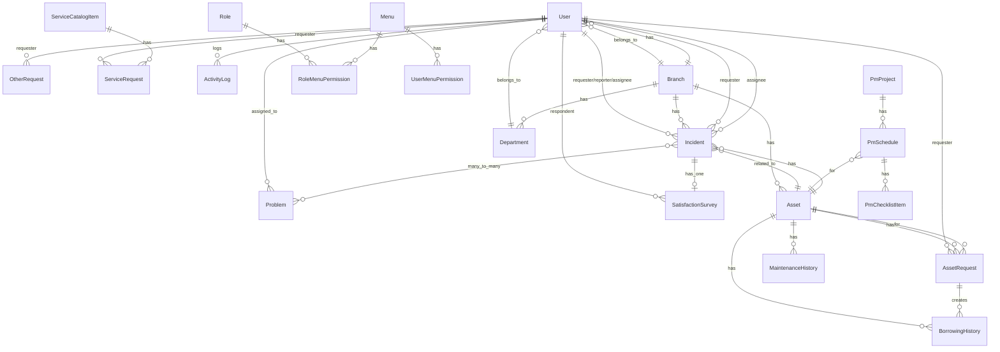

# 📦 Backend Modules Documentation
# เอกสารอธิบายการทำงานของทุก Module ในระบบ IT Support Pro

> อัปเดตล่าสุด: 2026-02-16

---

## สารบัญ

1. [Models (30 ไฟล์)](#1-models---โมเดลข้อมูล)
2. [Events (10 ไฟล์)](#2-events---broadcasting-events)
3. [Notifications (3 ไฟล์)](#3-notifications---การแจ้งเตือน)
4. [Services (2 ไฟล์)](#4-services---business-logic)
5. [Channels (1 ไฟล์)](#5-channels---ช่องทางส่งข้อมูล)
6. [Middleware (1 ไฟล์)](#6-middleware---ตรวจสอบก่อนเข้า-route)
7. [Scopes (1 ไฟล์)](#7-scopes---global-query-scope)
8. [Traits (1 ไฟล์)](#8-traits---reusable-behavior)
9. [Providers (1 ไฟล์)](#9-providers---service-providers)
10. [Routes](#10-routes---เส้นทาง-api)
11. [Database (Migrations & Seeders)](#11-database---migrations--seeders)
12. [ER Diagram](#12-er-diagram---ความสัมพันธ์ของข้อมูล)

---

## 1. Models - โมเดลข้อมูล

### 1.1 User
**ไฟล์:** `app/Models/User.php` | **Extends:** Authenticatable  
**Traits:** HasFactory, Notifiable, HasApiTokens (Sanctum)

| Field | Type | คำอธิบาย |
|-------|------|----------|
| name | string | ชื่อ-นามสกุล |
| username | string | ชื่อผู้ใช้ (unique) |
| email | string | อีเมล (unique) |
| password | string (hidden) | รหัสผ่าน |
| role | string | บทบาท (Admin, Technician, Helpdesk, etc.) |
| branch_id | FK | สาขาที่สังกัด |
| department_id | FK | แผนกที่สังกัด |
| organization | string | องค์กร |
| phone | string | เบอร์โทรศัพท์ |
| status | string | สถานะ (active/inactive) |

**Relationships:**

| Method | ประเภท | เชื่อมกับ |
|--------|--------|----------|
| `branch()` | belongsTo | Branch |
| `department()` | belongsTo | Department |
| `incidentsRequested()` | hasMany | Incident (requester_id) |
| `incidentsReported()` | hasMany | Incident (reported_by_id) |
| `incidentsAssigned()` | hasMany | Incident (assignee_id) |
| `assignedAssets()` | hasMany | Asset |
| `assignedProblems()` | hasMany | Problem |
| `assetRequests()` | hasMany | AssetRequest |
| `otherRequests()` | hasMany | OtherRequest |
| `serviceRequests()` | hasMany | ServiceRequest |
| `activityLogs()` | hasMany | ActivityLog |
| `satisfactionSurveys()` | hasMany | SatisfactionSurvey |
| `authoredArticles()` | hasMany | KbArticle (author_id) |
| `createdArticles()` | hasMany | KbArticle (created_by_id) |
| `notificationsCustom()` | hasMany | Notification |

---

### 1.2 Incident
**ไฟล์:** `app/Models/Incident.php` | **Traits:** HasFactory, HasBranch

| Field | คำอธิบาย |
|-------|----------|
| title | หัวข้อปัญหา |
| description | รายละเอียด |
| priority | ความสำคัญ (Critical/High/Medium/Low) |
| status | สถานะ (Open/In Progress/Resolved/Closed) |
| category, subcategory | หมวดหมู่ |
| requester_id, reported_by_id, assignee_id | FK → User |
| branch_id, department_id | FK → Branch, Department |
| asset_id, previous_asset_status | FK → Asset |
| asset_name/brand/model/serial_number/inventory_number | ข้อมูล asset (custom) |
| is_custom_asset | boolean - อุปกรณ์นอกระบบ |
| repair_details, repair_status | ข้อมูลการซ่อม |
| resolved_at, closed_at | datetime |
| satisfaction_rating, satisfaction_comment | ความพึงพอใจ |

**Relationships:** requester, reportedBy, assignee, asset, branch, department, problems (M2M), satisfactionSurvey

**Accessor:** `ticket_id` → `INC001`, `INC002`, ...

---

### 1.3 Asset
**ไฟล์:** `app/Models/Asset.php` | **Traits:** HasFactory, HasBranch

| Field | คำอธิบาย |
|-------|----------|
| name, type, category | ชื่อ, ประเภท, หมวดหมู่ |
| brand, model | ยี่ห้อ, รุ่น |
| serial_number | S/N (รองรับหลายตัวคั่นด้วย comma/newline) |
| inventory_number | เลขครุภัณฑ์ |
| quantity, status | จำนวน, สถานะ |
| serial_mapping | JSON - สถานะรายตัว serial |
| ip_address, mac_address | ข้อมูลเครือข่าย |
| license_key, license_type | ข้อมูล license (สำหรับ Software) |

**Accessors สำคัญ:**
- `serial_statuses` → คืน array ของ serial พร้อมสถานะ (Available/On Loan/Withdrawn/Maintenance/Retired)
- `available_quantity` → จำนวนที่ยังว่างอยู่

**Helper Methods:**
- `getSerialNumbersArray()` → แยก serial เป็น array
- `getBorrowedSerials()` → serial ที่ถูกยืม/เบิกอยู่
- `getAvailableSerials()` → serial ที่ว่างอยู่
- `getFirstAvailableSerial()` → serial แรกที่ว่าง

---

### 1.4 AssetRequest
**ไฟล์:** `app/Models/AssetRequest.php` | **Traits:** HasFactory, HasBranch

| Field | คำอธิบาย |
|-------|----------|
| requester_id, requester_name | ผู้ขอ |
| request_type | ประเภท (Requisition/Borrow/Replace) |
| asset_id, asset_type | สินทรัพย์ที่ขอ |
| borrowed_serial | serial ที่ถูกยืม |
| status | Pending/Approved/Rejected/Received |
| approved_at/by, rejected_at/by, received_at | tracking timestamps |
| due_date, borrow_date, return_date | วันที่ยืม-คืน |

**Accessor:** `ticket_id` → `REQ001`, `REQ002`, ...

---

### 1.5 BorrowingHistory
**ไฟล์:** `app/Models/BorrowingHistory.php`

| Field | คำอธิบาย |
|-------|----------|
| asset_id, user_id, user_name | สินทรัพย์ + ผู้ยืม |
| action_type | ยืม (borrow) / เบิก (requisition) / คืน (return) |
| action_date | วันที่ดำเนินการ |
| expected_return_date, actual_return_date | วันคืน |
| status | active / returned / overdue |
| processed_by | ผู้ดำเนินการ |

**Accessors:** `action_type_label` (ไทย), `status_label` (ไทย)

---

### 1.6 MaintenanceHistory
**ไฟล์:** `app/Models/MaintenanceHistory.php`

| Field | คำอธิบาย |
|-------|----------|
| asset_id, incident_id | เชื่อมกับ asset + incident |
| title, description, repair_status | รายละเอียดการซ่อม |
| technician_id, technician_name | ช่างผู้ซ่อม |
| start_date, completion_date | ช่วงเวลาซ่อม |
| has_cost, cost | ค่าใช้จ่าย |
| replacement_equipment | อุปกรณ์ทดแทน |

---

### 1.7 Branch
**ไฟล์:** `app/Models/Branch.php`

| Field | คำอธิบาย |
|-------|----------|
| code, name | รหัส, ชื่อสาขา |
| address, province, phone | ที่อยู่ |
| organization | องค์กร |
| telegram_chat_id | Chat ID (legacy notification) |
| notification_config | JSON - ตั้งค่าแจ้งเตือนรายสาขา |

**Relationships:** departments, users, assets, incidents, assetRequests, otherRequests, serviceRequests

---

### 1.8 Department
**ไฟล์:** `app/Models/Department.php`

| Field | คำอธิบาย |
|-------|----------|
| name | ชื่อแผนก |
| branch_id | FK → Branch |

---

### 1.9 BusinessHour
**ไฟล์:** `app/Models/BusinessHour.php`

| Field | คำอธิบาย |
|-------|----------|
| day_of_week | วัน (0=อาทิตย์ - 6=เสาร์) |
| open_time, close_time | เวลาเปิด-ปิด |
| is_closed | boolean - วันหยุด |

---

### 1.10 Holiday
**ไฟล์:** `app/Models/Holiday.php`

| Field | คำอธิบาย |
|-------|----------|
| name, type | ชื่อ, ประเภทวันหยุด |
| date, end_date | วันที่ |
| is_recurring | ทำซ้ำทุกปี |
| user_id | FK → User (สำหรับลารายบุคคล) |

**ประเภทวันหยุด:** public_holiday, company_holiday, sick_leave, annual_leave, personal_leave, other

**Scopes:** `affectsAll()` (วันหยุดทั่วไป), `forUser($id)` (รวมลาส่วนตัว)

---

### 1.11 Incident Title
**ไฟล์:** `app/Models/IncidentTitle.php`

| Field | คำอธิบาย |
|-------|----------|
| title | หัวข้อ incident สำเร็จรูป |
| category | หมวดหมู่ |
| priority | ความสำคัญ default |
| response_time, resolution_time | เวลา SLA default (นาที) |
| is_active | boolean |

---

### 1.12-1.14 Permission Models

**Role** (`app/Models/Role.php`)
- Fields: name, display_name, description, is_default

**RoleMenuPermission** (`app/Models/RoleMenuPermission.php`)
- Fields: role_id, menu_id, can_view, can_create, can_update, can_delete

**UserMenuPermission** (`app/Models/UserMenuPermission.php`)
- Fields: user_id, menu_id, can_view, can_create, can_update, can_delete (override role)

**Menu** (`app/Models/Menu.php`)
- Fields: key, name, description

---

### 1.15 Problem
**ไฟล์:** `app/Models/Problem.php` | **Traits:** HasFactory, HasBranch

| Field | คำอธิบาย |
|-------|----------|
| title, description, priority, status | ข้อมูลหลัก |
| assigned_to_id | FK → User |
| root_cause, workaround, solution | การวิเคราะห์ |

**Relationships:** assignedTo (User), incidents (M2M via `incident_problem`)

---

### 1.16 ServiceCatalogItem
**ไฟล์:** `app/Models/ServiceCatalogItem.php`

Fields: name, description, category, sla, cost, icon, estimated_time, is_active

---

### 1.17 ServiceRequest
**ไฟล์:** `app/Models/ServiceRequest.php` | **Traits:** HasFactory, HasBranch

| Field | คำอธิบาย |
|-------|----------|
| service_id, service_name | บริการที่ขอ |
| requester_id, requested_by | ผู้ขอ |
| status | Pending/Approved/Rejected/In Progress/Completed |
| approved_by_id, approved_at | ผู้อนุมัติ |
| completion_date | วันเสร็จ |

---

### 1.18 OtherRequest
**ไฟล์:** `app/Models/OtherRequest.php` | **Traits:** HasFactory, HasBranch

| Field | คำอธิบาย |
|-------|----------|
| title, item_name, item_type, request_type | รายการที่ขอ |
| quantity, unit, category | จำนวน |
| status | Pending/Approved/Rejected/Completed/Received |
| brand, model | ยี่ห้อ/รุ่นที่ขอ |

---

### 1.19 SatisfactionSurvey
**ไฟล์:** `app/Models/SatisfactionSurvey.php`

Fields: ticket_id, respondent_id, rating (1-5), comment, submitted_at

---

### 1.20 KbArticle
**ไฟล์:** `app/Models/KbArticle.php`

Fields: title, content, category, author_id, created_by_id, views, helpful, not_helpful, status

---

### 1.21 Sla
**ไฟล์:** `app/Models/Sla.php`

Fields: name, priority, response_time (นาที), resolution_time (นาที), description, is_active

---

### 1.22 OrganizationNotification
**ไฟล์:** `app/Models/OrganizationNotification.php`

Fields: organization_name, request_type, email_enabled/telegram_enabled/line_enabled, email_to, telegram_chat_id, telegram_token, line_token

---

### 1.23 PmProject
**ไฟล์:** `app/Models/PmProject.php`

| Field | คำอธิบาย |
|-------|----------|
| project_code | รหัสโครงการ (auto: PRJ-0001) |
| name, organization, department | ข้อมูลโครงการ |
| start_date, end_date, budget | ระยะเวลา + งบ |
| manager_id | FK → User |
| contract_file, tor_file | ไฟล์แนบ |
| status | Planning/In Progress/Completed/Cancelled |

**Static:** `generateProjectCode()` → auto PRJ-XXXX

---

### 1.24 PmSchedule
**ไฟล์:** `app/Models/PmSchedule.php`

| Field | คำอธิบาย |
|-------|----------|
| asset_id, assigned_to | สินทรัพย์ + ช่าง |
| frequency | Weekly/Monthly/Quarterly/Semi-Annually/Annually |
| scheduled_date, next_scheduled_date | วันที่กำหนด |
| status | Scheduled/In Progress/Completed/Cancelled/Overdue |
| check_result, notes, issues_found | ผลตรวจ |
| completed_at, completed_by | tracking |

**Methods:**
- `calculateNextScheduledDate()` → คำนวณวัน PM ถัดไป
- `isOverdue()` → เช็คเลยกำหนด
- **Scopes:** `status()`, `overdue()`, `upcoming($days)`

### 1.25 PmChecklistItem
**ไฟล์:** `app/Models/PmChecklistItem.php`

Fields: pm_schedule_id, title, description, is_checked, checked_at, checked_by, sort_order, notes

---

### 1.26 ActivityLog
**ไฟล์:** `app/Models/ActivityLog.php`

Fields: user_id, action, module, description, ip_address, user_agent, severity, event_type, metadata

---

### 1.27 Notification, 1.28 Subcontractor, 1.29 SystemSetting

| Model | Fields หลัก |
|-------|------------|
| **Notification** | user_id, type, message, read |
| **Subcontractor** | name, company, email, phone, specialty, province, bank info, status |
| **SystemSetting** | category, key, value, description |

---

## 2. Events - Broadcasting Events

ทุก Event implements `ShouldBroadcast` เพื่อส่ง realtime updates ผ่าน WebSocket

| Event | Channel | Broadcast Name | Data |
|-------|---------|---------------|------|
| `IncidentUpdated` | `incidents` (public) | `incident.{action}` | incident + action |
| `AssetUpdated` | `assets` (public) | `asset.{action}` | asset + action |
| `AssetRequestUpdated` | `asset-requests` (public) | `asset-request.{action}` | request + action |
| `BranchUpdated` | `branches` (public) | `branch.{action}` | branch + action |
| `DepartmentUpdated` | `departments` (public) | `department.{action}` | department + action |
| `UserUpdated` | `users` (public) | `user.{action}` | user + action |
| `KnowledgeBaseUpdated` | `knowledge-base` (public) | `kb.{action}` | article + action |
| `ServiceCatalogUpdated` | `service-catalog` (public) | `service-catalog.{action}` | item + action |
| `NewNotification` | `notifications` (public) | `notification.new` | notification data |
| `NewSurveyAvailable` | `user.{userId}` (**private**) | `survey.available` | survey data |

**รูปแบบทั่วไป:** constructor รับ Model + action string (default: 'updated')

---

## 3. Notifications - การแจ้งเตือน

### 3.1 IncidentNotification
**ไฟล์:** `app/Notifications/IncidentNotification.php`  
**Channels:** TelegramChannel + Database  
**Types:** created, updated, resolved, closed

- `toTelegram()` → สร้างข้อความ HTML พร้อม emoji, ticket ID, ข้อมูลผู้แจ้ง, priority
- `toArray()` → บันทึกลง database notifications

### 3.2 AssetRequestNotification
**ไฟล์:** `app/Notifications/AssetRequestNotification.php`  
**Channels:** TelegramChannel + Database  
**Types:** created, approved, rejected, received

### 3.3 OtherRequestNotification
**ไฟล์:** `app/Notifications/OtherRequestNotification.php`  
**Channels:** TelegramChannel + Database (ใช้ Queue: ShouldQueue)  
**Types:** created, approved, rejected, completed, received

---

## 4. Services - Business Logic

### 4.1 NotificationService
**ไฟล์:** `app/Services/NotificationService.php`

ส่งการแจ้งเตือนหลายช่องทางผ่านระบบ OrganizationNotification

| Method | คำอธิบาย |
|--------|----------|
| `sendNotification($org, $type, $data)` | ส่งแจ้งเตือนตาม event type + organization |
| `formatMessage($type, $data)` | สร้างข้อความตามประเภท (incident, requisition, borrow, replace) |
| `sendEmail($notif, $msg, $data)` | ส่ง email (ดึง SMTP config จาก SystemSetting) |
| `sendTelegram($notif, $msg)` | ส่งผ่าน Telegram Bot API |
| `sendLine($notif, $msg)` | ส่งผ่าน LINE Notify API |
| `getEmailSubject($type, $data)` | กำหนดหัวข้ออีเมลตามประเภท |

### 4.2 SlaCalculatorService
**ไฟล์:** `app/Services/SlaCalculatorService.php`

คำนวณ SLA โดยคิดเฉพาะเวลาทำการ (Business Hours)

| Method | คำอธิบาย |
|--------|----------|
| `loadBusinessHours()` | ดึงเวลาทำการจาก DB |
| `loadHolidays()` | ดึงวันหยุดจาก DB |
| `isHoliday($date)` | ตรวจสอบวันหยุด (รองรับ recurring) |
| `getBusinessHoursForDay($day)` | ดึงเวลาทำการของวัน |
| `isWithinBusinessHours($dt)` | เวลาอยู่ในเวลาทำการหรือไม่ |
| `calculateBusinessMinutes($start, $end)` | คำนวณนาทีทำการระหว่าง 2 เวลา |
| `calculateSlaDeadline($start, $minutes)` | คำนวณ deadline ของ SLA |
| `calculateRemainingSlaMinutes($start, $sla)` | นาทีที่เหลือ (ติดลบ = เกิน) |
| `getSlaStatus($start, $sla)` | สถานะ SLA: on_track / warning / breached |
| `formatMinutes($min)` | แปลงนาทีเป็นข้อความอ่านง่าย |

---

## 5. Channels - ช่องทางส่งข้อมูล

### 5.1 TelegramChannel
**ไฟล์:** `app/Channels/TelegramChannel.php`

Laravel Notification Channel สำหรับส่ง Telegram

**ลำดับการหา Chat ID:**
1. **OrganizationNotification** (ตามองค์กร + ประเภท request) → Priority 1
2. **Branch Settings** (legacy: telegram_chat_id ในตาราง branches) → Priority 2
3. ถ้าไม่เจอ → ข้ามการส่ง

**Bot Token:** ใช้ custom token ต่อ organization ก่อน → fallback ไป SystemSetting → fallback ไป .env

---

## 6. Middleware - ตรวจสอบก่อนเข้า Route

### 6.1 CheckMenuPermission
**ไฟล์:** `app/Http/Middleware/CheckMenuPermission.php`

**การใช้งาน:** `->middleware('menu.permission:incident_management,view')`

**ขั้นตอน:**
1. ดึง user จาก request
2. หา Role จากตาราง roles (ตาม user.role)
3. หา Menu จากตาราง menus (ตาม menuKey)
4. เช็ค RoleMenuPermission ว่า role+menu มี ability ที่ต้องการหรือไม่
5. Ability: `view`, `create`, `update`, `delete`
6. return 403 ถ้าไม่มีสิทธิ์

---

## 7. Scopes - Global Query Scope

### 7.1 BranchScope
**ไฟล์:** `app/Scopes/BranchScope.php`

**หน้าที่:** กรองข้อมูลอัตโนมัติตาม `branch_id` ของ user ที่ login

```
ถ้า role = Admin → เห็นทุก branch
ถ้า role อื่น → เห็นเฉพาะ branch ของตัวเอง
```

**ถูกใช้โดย:** Models ที่ `use HasBranch` trait

---

## 8. Traits - Reusable Behavior

### 8.1 HasBranch
**ไฟล์:** `app/Traits/HasBranch.php`

**หน้าที่ 2 อย่าง:**
1. **เพิ่ม BranchScope** → กรองข้อมูลตามสาขาอัตโนมัติ
2. **Auto-set branch_id** → เมื่อสร้างข้อมูลใหม่ ถ้าไม่ได้ระบุ branch_id จะดึงจาก user ที่ login

**Models ที่ใช้:** Incident, Asset, AssetRequest, OtherRequest, ServiceRequest, Problem

---

## 9. Providers - Service Providers

### 9.1 AppServiceProvider
**ไฟล์:** `app/Providers/AppServiceProvider.php`

Provider มาตรฐานของ Laravel (ไม่มีการ customize พิเศษ)

---

## 10. Routes - เส้นทาง API

### 10.1 api.php (303 บรรทัด)

**Public Routes (ไม่ต้อง Login):**

| Endpoint | Method | คำอธิบาย |
|----------|--------|----------|
| `/api/register` | POST | ลงทะเบียน |
| `/api/login` | POST | เข้าสู่ระบบ |
| `/api/health` | GET | Health check |
| `/api/health/database` | GET | Database health check |

**Protected Routes (ต้อง Login - auth:sanctum):**

| กลุ่ม | Prefix | Route สำคัญ |
|-------|--------|-------------|
| **Auth** | `/` | logout, me, password |
| **Users** | `/users` | CRUD + `/technicians` |
| **Branches** | `/branches` | CRUD + `/all` |
| **Departments** | `/departments` | CRUD + `/all` |
| **Assets** | `/assets` | CRUD + `/statistics`, `/bulk`, `/check-serial-numbers`, `/{id}/maintenance-history` |
| **Incidents** | `/incidents` | CRUD + `/statistics`, `/my`, `/assigned`, `/{id}/assign` |
| **Incident Titles** | `/incident-titles` | CRUD + `/all`, `/categories`, `/category/{cat}`, `/{id}/toggle` |
| **Problems** | `/problems` | CRUD + `/statistics`, `/link-incidents`, `/unlink-incidents` |
| **Asset Requests** | `/asset-requests` | CRUD + `/statistics`, `/my`, `/{id}/approve`, `/{id}/reject` |
| **Other Requests** | `/other-requests` | CRUD + `/statistics`, `/my`, `/{id}/approve/reject/complete/receive` |
| **Service Catalog** | `/service-catalog` | CRUD + `/all`, `/categories` |
| **Service Requests** | `/service-requests` | CRUD + `/statistics`, `/my`, `/{id}/approve/reject/start-progress/complete` |
| **SLA** | `/slas` | CRUD + `/all`, `/priority/{p}` |
| **SLA Calculator** | `/sla-calculator` | `/incident/{id}`, `/calculate`, `/business-minutes`, `/deadline`, `/is-business-hours`, `/open-incidents` |
| **Knowledge Base** | `/kb-articles` | CRUD + `/popular`, `/recent`, `/categories`, `/{id}/helpful`, `/{id}/not-helpful` |
| **Activity Logs** | `/activity-logs` | CRUD + `/my`, `/actions`, `/modules`, `/statistics`, `/security`, `/errors`, `/clear-old` |
| **Notifications** | `/notifications` | CRUD + `/my`, `/unread-count`, `/{id}/read`, `/mark-all-read`, `/clear-all` |
| **Roles** | `/roles` | CRUD + `/{role}/permissions`, `/{role}/permissions/reset-default` |
| **User Permissions** | `/users/{user}/permissions` | GET, PUT, `/reset` |
| **Surveys** | `/satisfaction-surveys` | CRUD + `/pending`, `/statistics`, `/check/{id}`, `/ticket/{id}` |
| **Business Hours** | `/business-hours` | CRUD + `/is-open`, `/day/{d}`, `/bulk` |
| **Holidays** | `/holidays` | CRUD + `/types`, `/for-sla`, `/upcoming`, `/check/{date}`, `/month/{m}` |
| **Subcontractors** | `/subcontractors` | CRUD + `/all`, `/specializations`, `/{id}/activate`, `/{id}/deactivate` |
| **System Settings** | `/system-settings` | CRUD + `/test-email`, `/categories`, `/key/{k}`, `/category/{c}`, `/key-value`, `/bulk` |
| **Org Notifications** | `/organization-notifications` | CRUD + `/initialize`, `/{id}/test/{channel}` |
| **PM Schedules** | `/pm-schedules` | CRUD + `/statistics`, `/{id}/execute` |
| **PM Projects** | `/pm-projects` | CRUD + `/statistics` |
| **Dashboard** | `/dashboard` | `/overview`, `/incidents-trend`, `/incidents-by-category`, `/incidents-by-priority`, `/top-technicians`, `/recent-incidents`, `/sla-compliance` |

### 10.2 channels.php
**Broadcast Channels:**
- `App.Models.User.{id}` → Private (ตรวจ user ID)
- `user.{id}` → Private (สำหรับ surveys, notifications)
- `incidents` → Public (ทุกคนที่ login ได้)

---

## 11. Database - Migrations & Seeders

### Migrations (82 ไฟล์)
ทุกตารางในระบบรวมถึง pivot tables (`problem_incident`) และ indexes

### Seeders (5 ไฟล์)

| Seeder | คำอธิบาย |
|--------|----------|
| `DatabaseSeeder` | เรียก seeders ย่อยตามลำดับ |
| `BusinessHourSeeder` | สร้างเวลาทำการเริ่มต้น 7 วัน |
| `IncidentTitleSeeder` | สร้างหัวข้อ incident ตามหมวดหมู่ (Hardware, Software, Network, etc.) |
| `SystemSettingsSeeder` | สร้าง settings เริ่มต้น (email, telegram, general) |
| `ExampleDataSeeder` | ข้อมูลตัวอย่างสำหรับ development |

---

## 12. ER Diagram - ความสัมพันธ์ของข้อมูล



---

## สรุปภาพรวมสถาปัตยกรรม

```
┌─────────────────────────────────────────────────┐
│                  Routes (api.php)                │
│           Public + Protected (Sanctum)           │
└────────────────────┬────────────────────────────┘
                     │
┌────────────────────▼────────────────────────────┐
│              Middleware Layer                     │
│   auth:sanctum    CheckMenuPermission (RBAC)     │
└────────────────────┬────────────────────────────┘
                     │
┌────────────────────▼────────────────────────────┐
│              Controllers (30)                    │
│   BaseCrudController → Specialized Controllers   │
└────────────────────┬────────────────────────────┘
                     │
┌────────────────────▼────────────────────────────┐
│    Services                Events                │
│    NotificationService     ShouldBroadcast (10)  │
│    SlaCalculatorService    → WebSocket           │
└────────────────────┬────────────────────────────┘
                     │
┌────────────────────▼────────────────────────────┐
│    Models (30) + HasBranch Trait + BranchScope   │
│    → Eloquent ORM → MySQL Database              │
└─────────────────────────────────────────────────┘
                     │
┌────────────────────▼────────────────────────────┐
│    Notifications (3) → Channels                  │
│    IncidentNotification     TelegramChannel      │
│    AssetRequestNotification Database             │
│    OtherRequestNotification Email (SMTP)         │
│                             LINE Notify          │
└─────────────────────────────────────────────────┘
```
